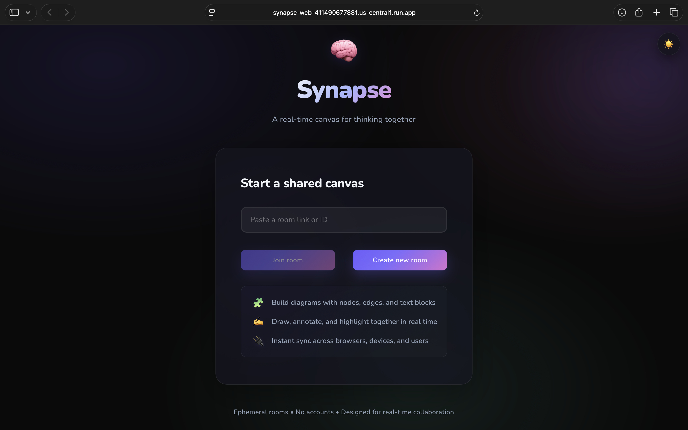
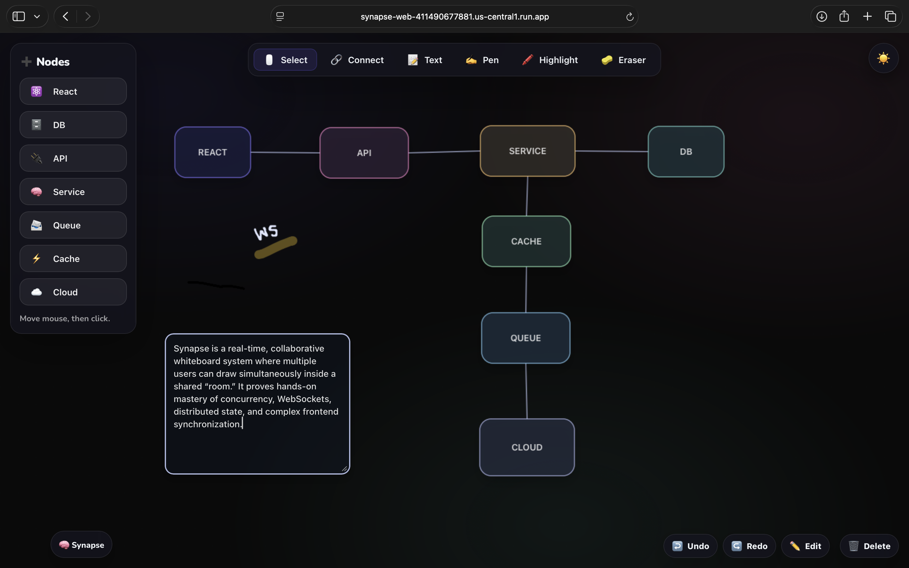
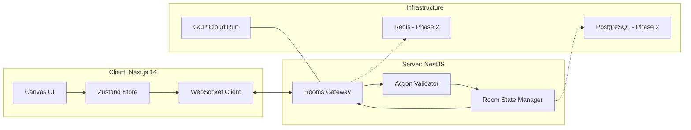

# 🧠 Synapse — Real-Time Collaborative Whiteboard

[](https://synapse-web-411490677881.us-central1.run.app)
[](#-tech-stack)
[](#-cloud-deployment)

**Synapse** is a production-grade, real-time collaborative whiteboard built for high-concurrency environments. It focuses on **distributed state synchronization**, **action-based updates**, and **low-latency bi-directional communication**, enabling multiple users to draw, type, and brainstorm on a shared infinite canvas.

🌐 **Live Demo:** [https://synapse-web-411490677881.us-central1.run.app](https://synapse-web-411490677881.us-central1.run.app)

---

## 🏠 Preview

### Homepage


### Canvas Overview


---

## 🔥 The Vision

> **The Problem:** Most whiteboards struggle with "many users, one shared canvas." The challenge isn’t rendering lines—it’s preserving **correctness under concurrency** when dozens of users interact simultaneously.

### Engineering Pillars
- **Action Stream Architecture:** Undo/Redo is driven by an immutable action stream instead of heavy state snapshots.
- **Server-Authoritative Model:** The backend validates and broadcasts updates, serving as the single source of truth.
- **Cloud-Native Discipline:** Container-first deployment with strict environment-driven CORS and security headers.

---

## 🚀 Getting Started

### 1. Clone the Repository

```bash
git clone https://github.com/<your-username>/synapse.git
cd synapse

```

### 2. Install Dependencies

**Frontend**

```bash
cd frontend
npm install

```

**Backend**

```bash
cd backend
npm install

```

---

### 3. Environment Variables

Create `.env` files in both folders to ensure the client can communicate with the server:

**`frontend/.env.local`**

```env
NEXT_PUBLIC_WS_URL=ws://localhost:3001
NEXT_PUBLIC_API_URL=http://localhost:3001

```

**`backend/.env`**

```env
PORT=3001
CORS_ORIGIN=http://localhost:3000

```

---

### 4. Start Development Servers

**Backend**

```bash
cd backend
npm run start:dev

```

**Frontend**

```bash
cd frontend
npm run dev

```

* **Frontend UI:** [http://localhost:3000](https://www.google.com/search?q=http://localhost:3000)
* **Backend (WS + HTTP):** [http://localhost:3001](https://www.google.com/search?q=http://localhost:3001)

---

## 🧩 Architecture Overview



---

## 🏗️ Technical Challenges & Trade-offs

### 1. Action Streams vs Full Snapshots
**Challenge:** Sending the entire canvas state for every tiny movement is bandwidth-heavy and scales poorly.  
**Solution:** Transmit only **deltas** (e.g., `MOVE_NODE`).  
**Result:** ~90% bandwidth reduction.  
**Trade-off:** Requires robust client-side logic to replay the action history accurately.

---

### 2. Collaborative Text “Flicker”
**Challenge:** Simultaneous typing causes cursor jumps or focus loss when remote updates arrive.  
**Solution:** A **stable focus model** that separates local optimistic input from remote confirmed updates.  
Focus shifts only when the user triggers a **blur** event.

---

### 3. Single-Port Constraint (Cloud Run)
**Challenge:** Google Cloud Run exposes only one port, complicating separation of HTTP and WebSocket traffic.  
**Solution:** Unified both protocols under a single NestJS instance, removing the need for a reverse proxy layer.

---

## 🧱 Tech Stack

| Layer       | Technologies |
|------------|--------------|
| **Frontend** |  <br>**Next.js 14**, **Zustand State Management** |
| **Backend** |  <br>**NestJS**, **Native WebSockets (Socket.io)** |
| **DevOps**  |  <br>**GCP Cloud Run**, **Artifact Registry**, **Docker** |

---

## 🎯 Core Features

### 🖌️ Canvas Interaction
- Node creation, selection, and multi-element dragging  
- Freehand Pen and translucent Highlighter tools  
- Stable, resizable textboxes with click-to-edit  
- High-performance pan and zoom for infinite canvases  

### 🤝 Real-Time Collaboration
- **Room Isolation:** Independent workspaces via dynamic routing  
- **Global Undo/Redo:** Shared history across all active users  
- **Low Latency:** Sub-100ms synchronization powered by WebSockets  

---

## 🚀 Phase 2 — Scalability Roadmap

### 🛰️ Redis — Distributed Messaging
- Pub/Sub for syncing events across horizontally scaled backend instances  
- High-speed caching for active room states to reduce DB load  

---

### 🗄️ PostgreSQL — Durable Snapshots
- Persistent snapshots to guarantee canvas recovery after restarts  
- **Hydration Logic:** Reloads state into Redis when a room becomes active  

---

> **Goal:** Use Redis for ultra-fast live collaboration and PostgreSQL for long-term persistence.
